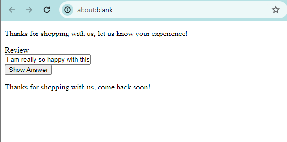
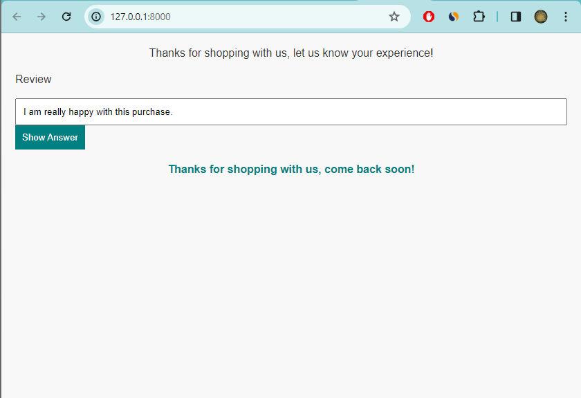
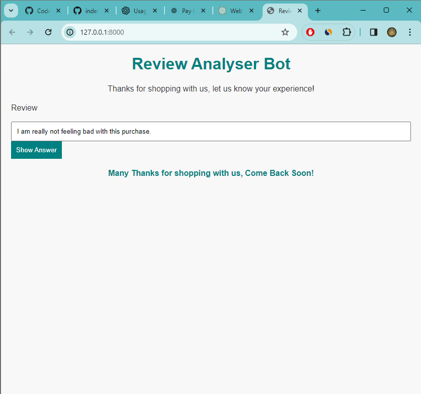
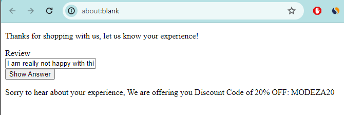
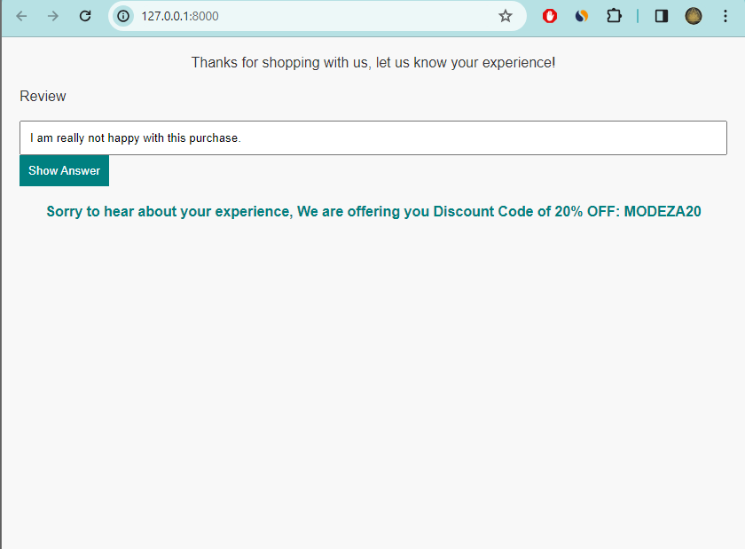
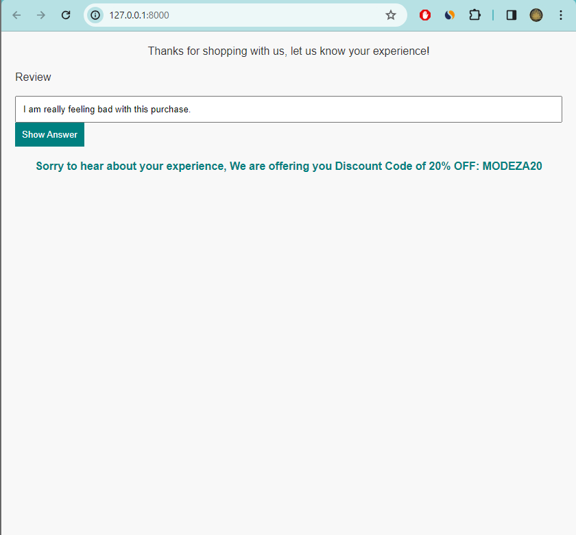

# Review Analyser & Discount Bot

## Description

Welcome to the Review Analyser & Discount Bot repository! This project provides a sentiment analysis bot powered by OpenAI's GPT-4. It analyzes user reviews and responds with appropriate messages based on the sentiment detected.

## Table of Contents
- [Bot Screenshots](#bot-screenshots)
- [Features](#features)
- [Getting Started](#getting-started)
- [Usage](#usage)
- [Contributing](#contributing)
- [License](#license)

## Bot Screenshots
### Review Results - Customer is Happy/Good/Satisfied



### Review Results - Customer is Sad/Unhappy/Unsatisfied




## Features

- Sentiment analysis of user reviews.
- Personalized responses based on detected sentiment.
- Simple and easy-to-use web interface.

## Getting Started

To get started with the Review Analyser & Discount Bot, follow these steps:

1. Clone the repository:

    ```bash
    git clone https://github.com/AyushMehta1702/Discount-Bot.git
    ```

2. Install dependencies:

    ```bash
    cd Discount-Bot
    pip install -r requirements.txt
    ```

3. Set up OpenAI API key:

    - Obtain an API key from [OpenAI](https://platform.openai.com/signup).
    - Create a `.env` file in the project root and add your API key:

        ```env
        OPENAI_API_KEY=your-api-key
        ```
## Usage

1. Open the web interface in your browser.
2. Enter a review in the input field.
3. Click the "Show Answer" button to see the bot's response.

## Contributing

If you'd like to contribute to this project, follow these steps:

1. Fork the repository.
2. Create a new branch:

    ```bash
    git checkout -b feature/new-feature
    ```

3. Commit your changes:

    ```bash
    git commit -m "Add new feature"
    ```

4. Push to the branch:

    ```bash
    git push origin feature/new-feature
    ```

5. Open a pull request.

## License

This project is licensed under the MIT License - see the [LICENSE](license.txt) file for details.


